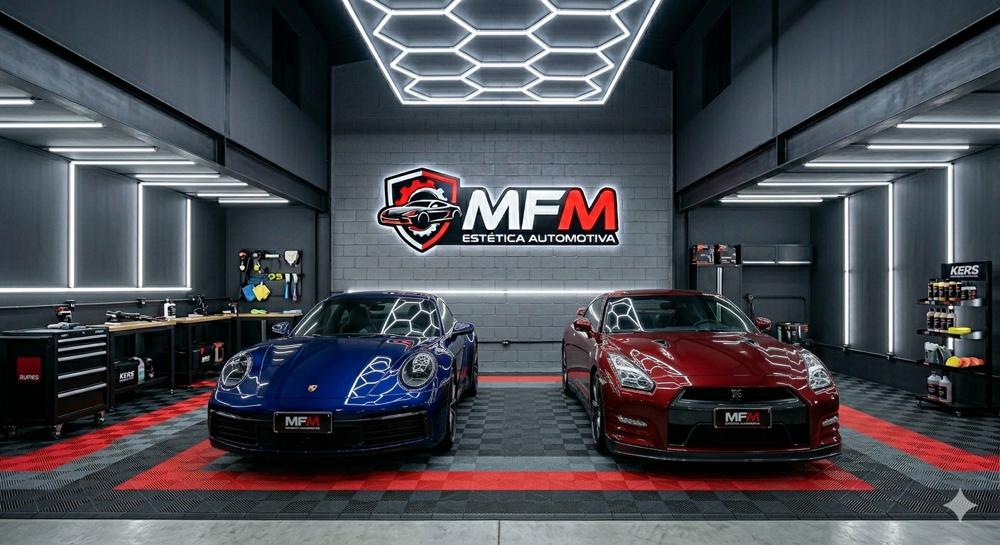
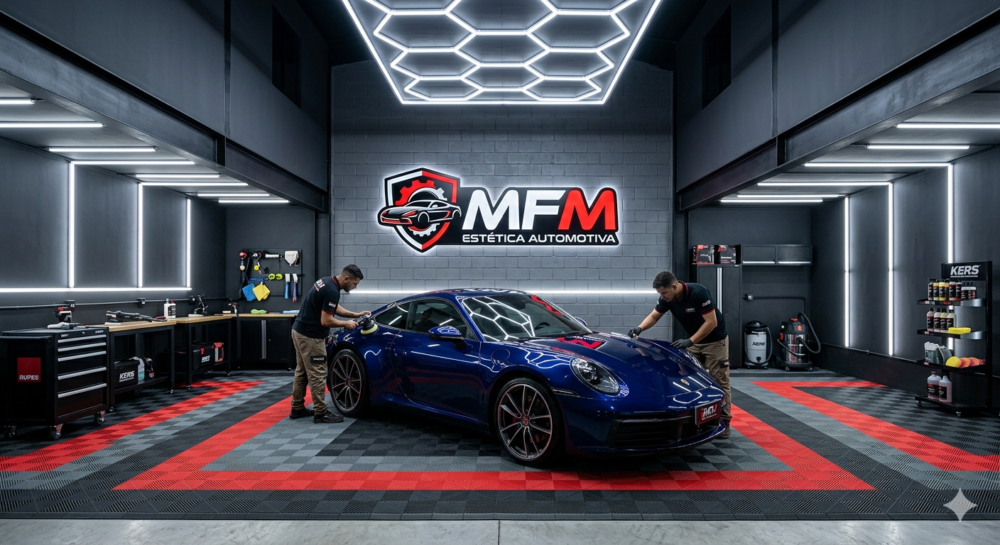

# 🚗 Projeto Estética Automotiva

Landing page moderna desenvolvida para uma empresa de estética automotiva, focada em apresentar serviços premium de detalhamento, polimento e vitrificação com um visual sofisticado e responsivo.

---

## ✨ Preview do Projeto



---

## 🚀 Tecnologias Utilizadas

- HTML5
- CSS3
- JavaScript
- Responsividade
- Animações CSS
- Git & GitHub

---

## 🎯 Objetivo do Projeto

Este projeto foi desenvolvido com foco em:

- Praticar estruturação semântica HTML
- Aprimorar estilização avançada com CSS
- Trabalhar responsividade para dispositivos móveis
- Criar interfaces modernas para portfólio
- Evoluir habilidades em JavaScript

---

## 🖥️ Funcionalidades

✅ Layout moderno  
✅ Design responsivo  
✅ Sessão de apresentação  
✅ Cards de serviços  
✅ Animações suaves  
✅ Botões interativos  
✅ Estrutura profissional para empresas

---

## 📸 Imagens do Projeto

### Página Inicial



---

## 📚 Atualmente Estudando

Estou em processo de transição de carreira para Desenvolvimento Full Stack.

Atualmente estudo:

- Análise e Desenvolvimento de Sistemas — UNIUBE
- Formação Full Stack — DEVCLUB

---

## 💡 Aprendizados

Durante este projeto pratiquei:

- Estruturação de páginas profissionais
- Organização de código
- Boas práticas de HTML e CSS
- Git e versionamento
- Publicação de projetos no GitHub

---

## 🔗 Deploy do Projeto

👉 Adicione aqui o link quando publicar:
```bash
https://seu-link-aqui.com
```

---

## 👨‍💻 Autor

Desenvolvido por Mike Willian 🚀


---

# ⭐ Obrigado por visitar este projeto!
